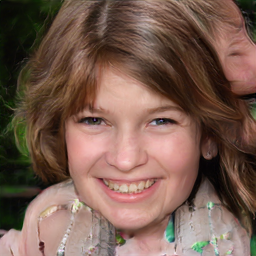

# StyleGAN2 on Runpod with `stylegan3`, `FFHQ aligned 256x256`, and `RTX A6000`

This repository documents and reproduces a clean Runpod workflow for training **StyleGAN2** through the official [NVlabs/stylegan3](https://github.com/NVlabs/stylegan3) repository on **FFHQ aligned** images converted to **256x256**.

## Preview

These sample outputs were generated from the final retained checkpoint:

- `training-runs/.../network-snapshot-005000.pkl`




## Project Setup

The final target configuration used in this project is:

- `1 GPU`
- `RTX A6000`
- Runpod image: `runpod/pytorch:2.1.0-py3.10-cuda11.8.0-devel-ubuntu22.04`
- official repo: `NVlabs/stylegan3`
- training mode: `--cfg=stylegan2`
- dataset: `FFHQ aligned`
- working resolution: `256x256`
- `--batch=64`
- `--batch-gpu=64`
- `--gamma=0.2048`
- `--mirror=1`
- `--aug=noaug`
- `--metrics=none`
- `--kimg=5000`
- `--snap=50`
- `--tick=4`
- `--map-depth=2`
- `--glr=0.0025`
- `--dlr=0.0025`
- `--cbase=16384`
- `--mbstd-group=4`

## Why this setup

The official `stylegan3` repository does not use a separate training config file. The effective training configuration is defined by:

- the CLI options of `train.py`
- the guidance in `docs/configs.md`
- the environment expectations described in `environment.yml`

This project keeps the **official repository unchanged** and wraps it with shell scripts for:

- dataset preparation
- dry-run validation
- real training
- image generation from snapshots

## Official references

- [NVlabs/stylegan3](https://github.com/NVlabs/stylegan3)
- `README.md`
- `train.py`
- `docs/configs.md`
- `environment.yml`
- [NVlabs/ffhq-dataset](https://github.com/NVlabs/ffhq-dataset)

## Hardware choice

The final implementation uses **one Runpod pod with an RTX A6000**.

Why this card was retained:

- `48 GB` VRAM gives enough margin to push batch size to `64`
- it is a better fit than the `RTX A5000` for a speed-oriented `256x256` training setup
- it keeps the training close to the official `StyleGAN2 256x256 1 GPU` logic while increasing throughput

The gamma value was adapted from the official `1 GPU` baseline:

- official base: `batch=16`, `gamma=0.8192`
- retained rule: `gamma_new = 0.8192 x 16 / batch_new`
- with `batch=64`, the retained value is `gamma=0.2048`

## Runpod pod configuration

Create a fresh Runpod pod with:

- GPU: `RTX A6000`
- image: `runpod/pytorch:2.1.0-py3.10-cuda11.8.0-devel-ubuntu22.04`
- HTTP port: `8888`
- container disk: `50 GB`
- volume disk: `150 GB` minimum

The project assumes the following working layout on the pod:

```text
/workspace/
├── data/
│   └── ffhq-aligned/
├── datasets/
├── generated-samples/
├── training-runs/
├── stylegan3/
├── prepare_ffhq.sh
├── train_dryrun_a6000.sh
├── train_stylegan2_ffhq_256_a6000.sh
└── generate_samples.sh
```

## Step 1 - Clone the official repository and validate the environment

Open the pod terminal and run:

```bash
cd /workspace
git clone https://github.com/NVlabs/stylegan3.git
cd /workspace/stylegan3

python -V
python -c "import torch; print(torch.__version__); print(torch.cuda.is_available()); print(torch.cuda.get_device_name(0))"
```

Install the required Python packages:

```bash
pip install click requests tqdm pyspng ninja imageio imageio-ffmpeg scipy matplotlib pillow
```

Then confirm that the repo is usable:

```bash
cd /workspace/stylegan3
python train.py --help
```

Acceptance checks for this step:

- Python is available
- PyTorch sees CUDA
- the correct GPU name is reported
- `train.py --help` works without error

## Step 2 - Create the working directories

```bash
mkdir -p /workspace/data/ffhq-aligned
mkdir -p /workspace/datasets
mkdir -p /workspace/training-runs
mkdir -p /workspace/generated-samples
```

## Step 3 - Place the raw FFHQ aligned images

Put the aligned FFHQ images into:

```text
/workspace/data/ffhq-aligned
```

This repository assumes the images are already available or were obtained legally before conversion.

Useful dataset sources:

- official FFHQ dataset repository: [NVlabs/ffhq-dataset](https://github.com/NVlabs/ffhq-dataset)
- Hugging Face dataset used during this implementation: [bitmind/ffhq-256](https://huggingface.co/datasets/bitmind/ffhq-256)

Important distinction:

- raw input images live in `/workspace/data/ffhq-aligned`
- the training-ready dataset is a ZIP generated afterward

## Step 4 - Create the dataset conversion script

Create `prepare_ffhq.sh`:

```bash
cat >/workspace/prepare_ffhq.sh <<'SH'
#!/usr/bin/env bash
set -euo pipefail

cd /workspace/stylegan3

python dataset_tool.py \
  --source=/workspace/data/ffhq-aligned \
  --dest=/workspace/datasets/ffhq-256x256.zip \
  --resolution=256x256
SH
chmod +x /workspace/prepare_ffhq.sh
```

Run the conversion:

```bash
/workspace/prepare_ffhq.sh
```

Verify the output:

```bash
ls -lh /workspace/datasets/ffhq-256x256.zip
```

Target output:

```text
/workspace/datasets/ffhq-256x256.zip
```

Acceptance checks for this step:

- the ZIP file exists
- `dataset_tool.py` completed without error
- the dataset is readable by `train.py`

## Step 5 - Create the dry-run script

Create `train_dryrun_a6000.sh`:

```bash
cat >/workspace/train_dryrun_a6000.sh <<'SH'
#!/usr/bin/env bash
set -euo pipefail

cd /workspace/stylegan3

python train.py \
  --outdir=/workspace/training-runs \
  --cfg=stylegan2 \
  --data=/workspace/datasets/ffhq-256x256.zip \
  --gpus=1 \
  --batch=64 \
  --batch-gpu=64 \
  --gamma=0.2048 \
  --mirror=1 \
  --aug=noaug \
  --metrics=none \
  --kimg=5000 \
  --snap=50 \
  --tick=4 \
  --map-depth=2 \
  --glr=0.0025 \
  --dlr=0.0025 \
  --cbase=16384 \
  --mbstd-group=4 \
  --dry-run
SH
chmod +x /workspace/train_dryrun_a6000.sh
```

Run the dry-run:

```bash
/workspace/train_dryrun_a6000.sh
```

What the dry-run must validate:

- dataset path is correct
- ZIP is readable
- CLI options are accepted
- GPU is available
- CUDA starts correctly
- the run directory can be prepared

Fallback if memory is insufficient:

- switch to `--batch=32`
- switch to `--batch-gpu=32`
- switch to `--gamma=0.4096`

## Step 6 - Create the real training script

Create `train_stylegan2_ffhq_256_a6000.sh`:

```bash
cat >/workspace/train_stylegan2_ffhq_256_a6000.sh <<'SH'
#!/usr/bin/env bash
set -euo pipefail

cd /workspace/stylegan3

python train.py \
  --outdir=/workspace/training-runs \
  --cfg=stylegan2 \
  --data=/workspace/datasets/ffhq-256x256.zip \
  --gpus=1 \
  --batch=64 \
  --batch-gpu=64 \
  --gamma=0.2048 \
  --mirror=1 \
  --aug=noaug \
  --metrics=none \
  --kimg=5000 \
  --snap=50 \
  --tick=4 \
  --map-depth=2 \
  --glr=0.0025 \
  --dlr=0.0025 \
  --cbase=16384 \
  --mbstd-group=4
SH
chmod +x /workspace/train_stylegan2_ffhq_256_a6000.sh
```

Launch the training:

```bash
nohup /workspace/train_stylegan2_ffhq_256_a6000.sh > /workspace/train_a6000.log 2>&1 &
tail -f /workspace/train_a6000.log
```

Why these parameters were retained:

- `--cfg=stylegan2`: the project explicitly trains StyleGAN2 through the official `stylegan3` repo
- `--gpus=1`: single-GPU Runpod setup
- `--batch=64`: speed-oriented configuration retained for RTX A6000
- `--gamma=0.2048`: adapted from the official 1-GPU 256x256 baseline
- `--mirror=1`: retained for FFHQ
- `--aug=noaug`: fast setup, acceptable for FFHQ at this scale
- `--metrics=none`: removes FID computation overhead during training
- `--kimg=5000`: short, practical training target for a first fast run
- `--snap=50`: fewer snapshots, reduced overhead
- `--tick=4`: clean logging cadence
- `--map-depth=2`, `--glr=0.0025`, `--dlr=0.0025`, `--cbase=16384`, `--mbstd-group=4`: kept aligned with the official guidance

## Step 7 - Understand logs, ticks, and snapshots

With the retained configuration:

- `tick=4` means one log step every `4 kimg`
- `snap=50` means one snapshot every `50 ticks`

So the first snapshot arrives roughly every:

```text
50 x 4 = 200 kimg
```

Typical snapshot names:

- `network-snapshot-000200.pkl`
- `network-snapshot-000400.pkl`
- `network-snapshot-001000.pkl`
- `network-snapshot-005000.pkl`

Useful log commands:

```bash
tail -f /workspace/train_a6000.log
```

```bash
tail -f /workspace/training-runs/00000-stylegan2-ffhq-256x256-gpus1-batch64-gamma0.2048/log.txt
```

List available snapshots:

```bash
ls -lh /workspace/training-runs/00000-stylegan2-ffhq-256x256-gpus1-batch64-gamma0.2048/*.pkl
```

## Step 8 - Create the image generation script

Create `generate_samples.sh`:

```bash
cat >/workspace/generate_samples.sh <<'SH'
#!/usr/bin/env bash
set -euo pipefail

NETWORK="${1:?Usage: $0 /path/to/network-snapshot.pkl}"

cd /workspace/stylegan3

python gen_images.py \
  --outdir=/workspace/generated-samples \
  --trunc=1 \
  --seeds=0-31 \
  --network="$NETWORK"
SH
chmod +x /workspace/generate_samples.sh
```

Generate images from a snapshot:

```bash
/workspace/generate_samples.sh /workspace/training-runs/00000-stylegan2-ffhq-256x256-gpus1-batch64-gamma0.2048/network-snapshot-005000.pkl
```

This writes images into:

```text
/workspace/generated-samples
```

The script uses:

- `--trunc=1`
- `--seeds=0-31`

so the default output is a batch of 32 images with fixed seeds, making snapshot comparison easier.

## What was actually validated in this project

The following points were validated during implementation:

- the Runpod pod saw the `RTX A6000`
- `python train.py --help` worked
- the FFHQ aligned dataset was converted into `/workspace/datasets/ffhq-256x256.zip`
- the dry-run passed
- the real training started successfully
- the run directory was created under `/workspace/training-runs`
- snapshots were produced
- image generation from the final snapshot worked

The final retained model artifact is:

```text
training-runs/.../network-snapshot-005000.pkl
```

## Repository scripts

The delivered shell scripts are:

- `prepare_ffhq.sh`
- `train_dryrun_a6000.sh`
- `train_stylegan2_ffhq_256_a6000.sh`
- `generate_samples.sh`

This repository also contains helper files and historical notes, but the main execution path is the four-step shell workflow above.

## Reproducibility notes

The workflow is designed to remain reproducible on a fresh Runpod pod:

- clone the official repo
- verify CUDA and PyTorch
- create the dataset ZIP
- validate the config with a dry-run
- launch the real training
- generate images from a chosen snapshot

The official repository stays unpatched. All project-specific behavior is handled by wrapper scripts and fixed paths under `/workspace`.

## Git LFS note

The final snapshot is large and should be stored with **Git LFS**.

If you clone this repository on a new machine and want the final snapshot:

```bash
git lfs install
git clone <repo-url>
```

Or, if the repository is already cloned:

```bash
git lfs pull
```

## Troubleshooting

### GPU is visible but dry-run fails

Check:

```bash
python -c "import torch; print(torch.cuda.is_available()); print(torch.cuda.get_device_name(0))"
```

Then rerun:

```bash
cd /workspace/stylegan3
python train.py --help
```

### Out-of-memory on RTX A6000

Fallback configuration:

- `--batch=32`
- `--batch-gpu=32`
- `--gamma=0.4096`

### The first snapshot does not appear immediately

This is expected. With:

- `--tick=4`
- `--snap=50`

the first snapshot is produced around `200 kimg`, not at `50 kimg`.

### `generate_samples.sh` does not produce images

Check:

- the snapshot path is correct
- the file exists
- the path passed to `--network` points to a real `.pkl`

Then rerun:

```bash
/workspace/generate_samples.sh /path/to/network-snapshot-005000.pkl
```

## Summary

This repository captures a clean and fast workflow for:

1. preparing a fresh Runpod pod
2. using the official `stylegan3` repo without patching it
3. converting `FFHQ aligned` into a `256x256` ZIP dataset
4. validating the setup with a dry-run
5. training `StyleGAN2` on a single `RTX A6000`
6. keeping the final snapshot
7. generating synthetic face samples from that snapshot

The retained reference configuration is the `RTX A6000` fast setup with:

- `batch=64`
- `gamma=0.2048`
- `metrics=none`
- `kimg=5000`
- `snap=50`

It is the master configuration described by this README.
